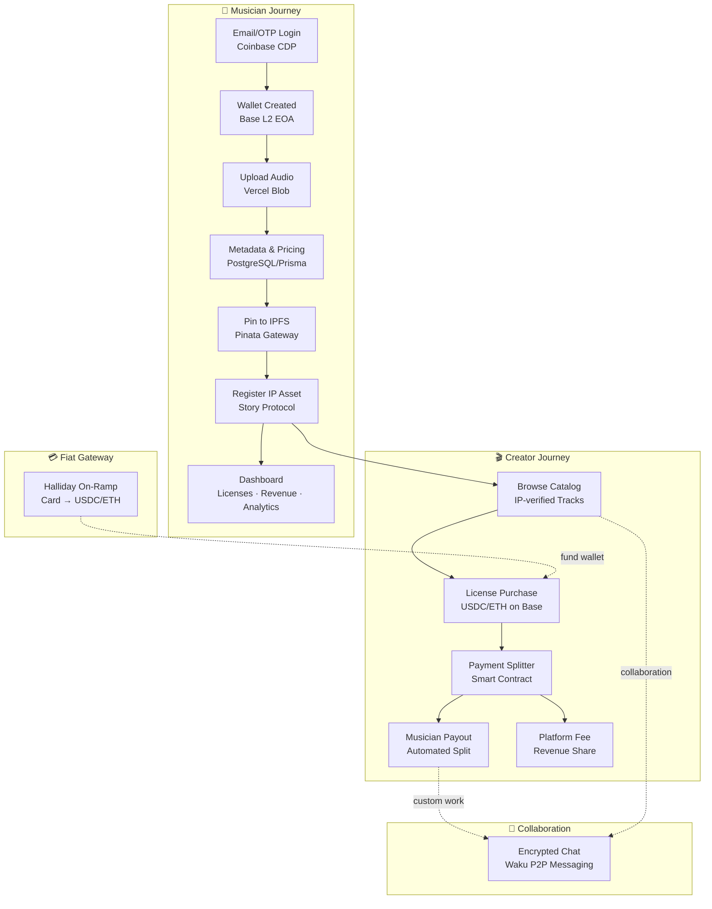

<div align="center">


# 🎵 SIDE B SESSIONS

### *On-chain IP for independent music*

**Built for musicians who won't play the influencer game — and creators who need real music.**

</div>

---

## 🎧 The Essence

<div align="center">

> **The Problem**
> Musicians don't meaningfully profit from streaming unless they become content creators or influencers.
> The algorithm rewards personal brand over artistry. Practice hours and songwriting don't pay bills.

</div>

**Our Solution:** Side B Sessions transforms voice notes, jams, and under-monetized tracks into licensable IP assets that filmmakers, content creators, and indie game studios can discover and license directly.

This is a **marketplace** where musicians and visual artists meet — not just a licensing platform. It's also a **collaboration space** where sonic creatives who excel musically but struggle with video can connect with visual artists who understand their sound and co-create together.

**IP rights are the foundation:** We use [Story Protocol](https://story.foundation) to guarantee that rights, provenance, and payouts are handled correctly — on-chain, transparent, and automatic. Every upload becomes a registered IP asset. Every license is traceable. Every payment settles fairly.

<div align="center">

> *We honor practice hours and songwriting, not follower counts — IP rights flow from the music itself.*

</div>

---

## 🎬 How It Works

<details open>
<summary><b>User Flow — From Upload to Payout</b></summary>

<br/>

**For Musicians:**
1. **Sign in** with email/OTP → get a non-custodial wallet automatically (Coinbase CDP)
2. **Upload** your track or jam → audio stored on Vercel Blob, validated, pinned to IPFS via Pinata
3. **Register** as IP asset → Story Protocol creates on-chain provenance for your work
4. **Set pricing** → define licensing terms and prices in USDC/ETH
5. **Track analytics** → see who licenses your music, how much you earn, usage stats

**For Creators:**
1. **Browse** the catalog → discover IP-verified tracks ready for licensing
2. **Preview & License** → stream previews, purchase licenses with USDC/ETH on Base L2
3. **Fiat on-ramp** → use credit card via Halliday if you don't have crypto
4. **Payment verified** → smart contract confirms transfer before unlocking downloads
5. **Download & Use** → commercial-grade licenses for film, content, games, etc.

**For Collaboration:**
- **Encrypted messaging** via Waku → coordinate custom work, negotiate extras, plan visual collaborations privately
- **Direct connections** → musicians find visual artists, filmmakers discover sound designers

</details>

---

## 💿 Feature Overview

| Feature | What It Does | Why It Matters |
|---------|-------------|----------------|
| 🎯 **IP Registration** | Every upload becomes a Story Protocol IP asset with on-chain provenance | Protects your rights before anyone can use your music |
| ✉️ **Email → Wallet** | Coinbase CDP creates non-custodial wallets via email/OTP | No seed phrases, no friction — just email login |
| 🎵 **Audio Pipeline** | Upload validation → IPFS pinning → metadata storage | Permanent, decentralized storage for your tracks |
| 💸 **Licensing on Base** | USDC/ETH payments on Base L2 with low fees | Fast, cheap transactions aligned with Story Protocol |
| 💳 **Fiat On-Ramp** | Halliday integration for credit card purchases | Creators without crypto can still buy licenses |
| 🤝 **Payment Verification** | Smart contract verifies transfers before unlocking downloads | No manual approval — trustless and instant |
| 🔒 **Encrypted Chat** | Waku P2P messaging for private collaboration planning | End-to-end encrypted, decentralized communication |
| 📊 **Artist Dashboard** | Track licenses, revenue, and usage analytics | Full transparency on who's using your music |
| 🎨 **Creator Discovery** | Browse by genre, mood, instrumentation | Find the perfect sound for your project |

---

## 🏗️ Architecture Overview

<details>
<summary><b>System Diagram — Full Stack Flow</b></summary>

<br/>



</details>

---

## 🔧 Tech Stack

<div align="center">

> **One stack. Full IP lifecycle. Web3 UX that feels like Web2.**

</div>

### Web3 & IP Infrastructure

[](https://story.foundation)
[](https://base.org)
[](https://coinbase.com/cloud)
[](https://halliday.xyz/)
[](https://waku.org)

- **Story Protocol SDK** — IP asset registration, licensing workflows, on-chain provenance
- **Base L2** — USDC/ETH payments, low fees, Story Protocol alignment
- **Coinbase CDP** — Email/OTP authentication, non-custodial wallets, no seed phrases
- **Halliday** — Credit card → crypto on-ramp for seamless fiat purchases
- **Waku** — Decentralized P2P messaging with end-to-end encryption

### Frontend & User Experience

[](https://nextjs.org)
[](https://react.dev)
[](https://tailwindcss.com)

- **Next.js 14** — App Router, server components, optimized routing
- **React 18** — TypeScript-first, modern hooks, concurrent features
- **Tailwind + shadcn/ui** — Rapid UI development with accessible components
- **Particles.js** — Interactive visual effects for artist branding

### Smart Contracts & Security

[](https://github.com/foundry-rs/foundry)
[](https://openzeppelin.com/contracts/)
[](https://viem.sh)

- **Foundry** — Solidity testing, deployment, contract scripting
- **OpenZeppelin** — Battle-tested ERC-20, payment splitter contracts
- **Viem** — Type-safe Ethereum interactions, transaction verification

### Storage, Database & Infrastructure

[](https://pinata.cloud/)
[](https://neon.tech/)
[](https://vercel.com)

- **Pinata IPFS** — Permanent metadata and asset storage
- **Neon PostgreSQL** — Serverless database for catalog and analytics
- **Vercel Blob** — Audio upload intake and validation
- **Prisma** — Type-safe database ORM

---

## 🛠 For Devs: Setup & Code

<details>
<summary><b>Quick Start — Installation</b></summary>

<br/>

### Prerequisites
- Node.js 18+
- PostgreSQL (or use Neon serverless)
- API keys for: Coinbase CDP, Story Protocol, Pinata, Halliday

### Setup Steps

```bash
# 1. Install dependencies
npm install

# 2. Copy environment template
cp .env.example .env

# 3. Configure your .env with API keys
# See docs/INSTALLATION.md for detailed key setup

# 4. Initialize database
npx prisma generate
npx prisma db push

# 5. Run development server
npm run dev
```

### Environment Variables

Key integrations require these environment variables:

```bash
# Story Protocol
STORY_RPC_URL=
STORY_PRIVATE_KEY=
SPG_CONTRACT=

# Coinbase CDP
COINBASE_API_KEY_NAME=
COINBASE_API_KEY_SECRET=

# Base L2
BASE_RPC_URL=
BASE_PRIVATE_KEY=

# IPFS / Pinata
PINATA_JWT=
PINATA_GATEWAY=

# Halliday
HALLIDAY_API_KEY=

# Database
DATABASE_URL=

# Waku
WAKU_CONTENT_TOPIC=
```

Full setup guide: [`docs/INSTALLATION.md`](docs/INSTALLATION.md)

</details>

<details>
<summary><b>Documentation Vault</b></summary>

<br/>

> Comprehensive guides for every integration

```
docs/
├── 📘 INSTALLATION.md          Complete setup guide + .env.example
├── 🏗️  ARCHITECTURE.md          System design and data flow diagrams
├── 🔐 COINBASE_INTEGRATION.md  CDP wallet setup and authentication
├── 🎯 STORY_PROTOCOL.md         IP registration workflows
├── 💬 WAKU_MESSAGING.md         P2P messaging implementation
├── 💳 PAYMENT_FLOWS.md          ERC-20 verification + Halliday
├── 📦 SMART_CONTRACTS.md        Foundry setup + OpenZeppelin
└── 🚀 DEPLOYMENT.md             Production deployment checklist
```

**Start here:** [`docs/INSTALLATION.md`](docs/INSTALLATION.md) — full environment setup in under 5 minutes

</details>

<details>
<summary><b>Quick Code Example — Story Protocol IP Registration</b></summary>

<br/>

```typescript
import { StoryClient } from '@story-protocol/core-sdk'
import { http } from 'viem'
import { privateKeyToAccount } from 'viem/accounts'

// Initialize Story Protocol client
export const storyClient = StoryClient.newClient({
  transport: http(process.env.STORY_RPC_URL),
  chainId: 'aeneid',
  account: privateKeyToAccount(process.env.STORY_PRIVATE_KEY as `0x${string}`)
})

// Register track as IP asset
export async function registerIPAsset(
  ipfsHash: string,
  nftContract: string,
  tokenId: string
) {
  const response = await storyClient.ipAsset.register({
    nftContract,
    tokenId,
    metadata: {
      metadataURI: ipfsHash,
      metadataHash: keccak256(ipfsHash)
    }
  })

  return response.ipId // On-chain IP identifier
}
```

See full implementation: [`lib/story.ts`](lib/story.ts)

</details>

---

## 📂 Key Integrations — Code Map

<div align="center">

> **Every integration, one file. Clean separation of concerns.**

</div>

| Integration | Purpose | File Location |
|------------|---------|---------------|
| 🎯 **Story Protocol** | IP asset registration and licensing | [`lib/story.ts`](lib/story.ts) |
| 🔐 **Coinbase CDP** | Email/OTP authentication and wallet creation | [`components/providers/CoinbaseProvider.tsx`](components/providers/CoinbaseProvider.tsx) |
| 💬 **Waku Messaging** | P2P encrypted chat setup and message handling | [`components/waku/WakuProvider.tsx`](components/waku/WakuProvider.tsx) |
| 💰 **Payment Verification** | ERC-20 transfer validation before license unlock | [`lib/payment-verification.ts`](lib/payment-verification.ts) |
| 📌 **Pinata IPFS** | Metadata pinning and gateway access | [`lib/pinata.ts`](lib/pinata.ts) |
| 💳 **Halliday** | Fiat on-ramp integration for credit card purchases | [`lib/halliday.ts`](lib/halliday.ts) |
| 🎵 **Audio Upload** | Vercel Blob intake and validation pipeline | [`app/api/sessions/route.ts`](app/api/sessions/route.ts) |

<details>
<summary><b>Detailed Integration Examples</b></summary>

<br/>

### Story Protocol — IP Registration
```typescript
// lib/story.ts
export async function registerTrack(ipfsHash: string, price: bigint) {
  return storyClient.ipAsset.register({
    nftContract: process.env.SPG_CONTRACT!,
    tokenId: generateTokenId(),
    metadata: {
      metadataURI: ipfsHash,
      licensingFee: price
    }
  })
}
```

### Coinbase CDP — Email Authentication
```typescript
// components/providers/CoinbaseProvider.tsx
const sdk = new CoinbaseWalletSDK({
  appName: 'Side B Sessions',
  enableCDP: true,
  cdpConfig: {
    apiKeyName: process.env.COINBASE_API_KEY_NAME!,
    apiKeySecret: process.env.COINBASE_API_KEY_SECRET!
  }
})

const provider = sdk.makeWeb3Provider()
await provider.request({
  method: 'eth_requestAccounts',
  params: { loginType: 'email' }
})
```

### Waku — Encrypted Messaging
```typescript
// components/waku/WakuProvider.tsx
const node = await createLightNode({
  defaultBootstrap: true,
  shardInfo: { contentTopics: ['/sideb/1/messages/proto'] }
})

await node.start()
await waitForRemotePeer(node, [Protocols.LightPush, Protocols.Filter])
```

### Payment Verification — Smart Contract
```typescript
// lib/payment-verification.ts
export async function verifyPayment(
  txHash: string,
  expectedAmount: bigint,
  recipient: string
) {
  const receipt = await client.getTransactionReceipt({ hash: txHash })
  const transferEvent = receipt.logs.find(
    log => log.topics[0] === keccak256('Transfer(address,address,uint256)')
  )

  return transferEvent?.topics[2] === recipient &&
         BigInt(transferEvent.data) >= expectedAmount
}
```

</details>

---

## 🎯 What Makes This Different

<div align="center">

> **This isn't just a Story Protocol demo. It's a complete Web3 music marketplace.**

</div>

### Core Differentiators

- **🎵 Licensing over Streaming** — Musicians earn from usage rights, not play counts
- **🤝 Direct Marketplace** — No intermediaries between musicians and creators
- **✉️ Email → Crypto** — Onboarding feels like Web2, powered by Web3
- **💬 Private Collaboration** — Encrypted P2P messaging for custom work negotiations
- **🛡️ IP-First Architecture** — Story Protocol ensures rights are immutable and transparent
- **💳 Fiat-Friendly** — Credit card on-ramp via Halliday removes crypto barriers
- **📊 Full Transparency** — Artists see every license, every payment, every usage

### Technical Integration Highlights

<details open>
<summary><b>Beyond the Hackathon — Full Stack Integration</b></summary>

<br/>

| Technology | Integration Purpose | Why It Matters |
|-----------|-------------------|----------------|
| **Story Protocol**[^story] | IP registry and licensing infrastructure | Core blockchain IP foundation — provenance for every track |
| **Coinbase CDP**[^cdp] | Email/OTP wallet creation | Makes crypto invisible to users — no seed phrases, just email |
| **Waku Protocol**[^waku] | Decentralized encrypted messaging | True privacy without centralized servers |
| **Halliday**[^halliday] | Fiat-to-crypto on-ramp | Credit card → USDC seamlessly — no exchange accounts needed |
| **Base L2**[^base] | Payment settlement chain | Low fees, fast finality, aligned with Story Protocol ecosystem |
| **IPFS/Pinata**[^pinata] | Permanent metadata storage | Decentralized, immutable storage for track metadata |
| **OpenZeppelin + Foundry** | Battle-tested smart contracts | Production-grade ERC-20 libraries and testing framework |

</details>

---

## 🏆 Built at Surreal World Assets Buildathon, intended to continue as the place where those musicians who don't want to play the influencer game, find a way to monetize their art and the creators find authentic sounds. 

<div align="center">

**[Surreal World Assets Buildathon 2025](https://www.encodeclub.com/programmes/surreal-world-assets-buildathon-2)**

*Proving Web3 IP rights can be as simple as email login*

<br/>

```
━━━━━━━━━━━━━━━━━━━━━━━━━━━━━━━━━━━━━━━━━━━━━━━━━━━━━━━━━━━━━━━━━
MUSIC IS NOT CONTENT. IT'S ART. IT DESERVES BLOCKCHAIN RIGHTS AND MONETIZATION BEYOND STREAMING COUNTS. 
━━━━━━━━━━━━━━━━━━━━━━━━━━━━━━━━━━━━━━━━━━━━━━━━━━━━━━━━━━━━━━━━━
```

<br/>

**Built for musicians, by a musician. From México with** 

</div>

---

[^story]: **Story Protocol** — Programmable IP infrastructure for on-chain assets and licensing. [docs.story.foundation](https://docs.story.foundation)

[^cdp]: **Coinbase Developer Platform** — Embedded wallets with email/OTP authentication. [docs.cdp.coinbase.com](https://docs.cdp.coinbase.com)

[^base]: **Base** — Ethereum L2 optimized for low-fee payments and Web3 applications. [docs.base.org](https://docs.base.org)

[^waku]: **Waku** — Decentralized P2P messaging protocol with end-to-end encryption. [docs.waku.org](https://docs.waku.org)

[^halliday]: **Halliday** — Fiat-to-crypto on-ramp for seamless credit card purchases. [halliday.xyz](https://halliday.xyz/)

[^pinata]: **Pinata** — IPFS pinning service for permanent decentralized storage. [pinata.cloud](https://pinata.cloud/)
