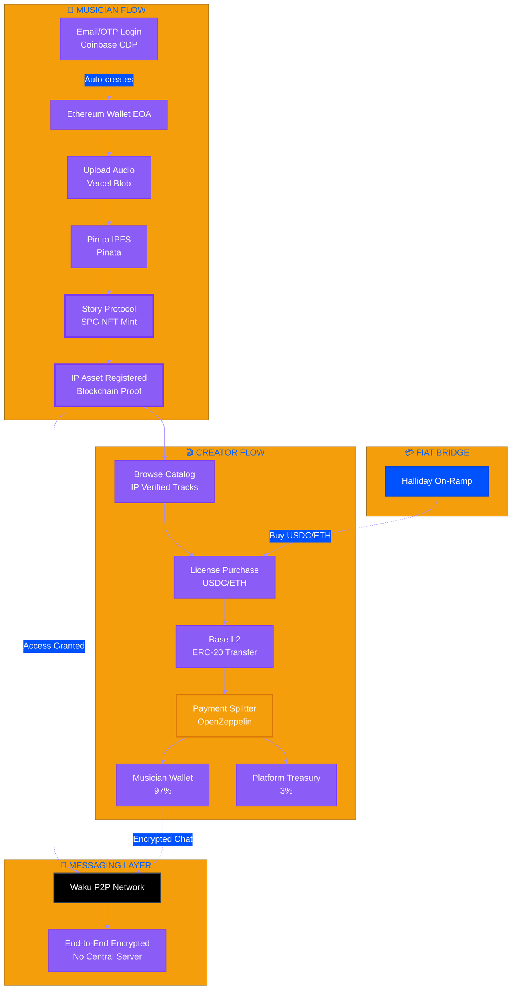

<div align="center">


# 🎵 SIDE B SESSIONS

### *The B-side of music IP — raw, authentic, unstoppable*

[](https://story.foundation)
[](https://coinbase.com/cloud)
[](https://base.org)
[](https://waku.org)

[](https://nextjs.org)
[](https://typescriptlang.org)
[](https://prisma.io)
[](https://pinata.cloud)

```
━━━━━━━━━━━━━━━━━━━━━━━━━━━━━━━━━━━━━━━━━━━━━━━━━━━━━━━━━━━━━━━━━━━━━━━━━━━
    UPLOAD  →  REGISTER IP  →  LICENSE  →  EARN  →  OWN YOUR FUTURE
━━━━━━━━━━━━━━━━━━━━━━━━━━━━━━━━━━━━━━━━━━━━━━━━━━━━━━━━━━━━━━━━━━━━━━━━━━━
```

**[📖 Documentation](#-documentation-vault)** • **[🚀 Installation](docs/INSTALLATION.md)** • **[🏗️ Architecture](#-architecture)** • **[🎯 Live Demo](https://side-b.vercel.app)**

</div>

---

## 🎧 The Essence

Musicians upload sessions → **Story Protocol** mints IP asset → catalog listing → creators license with **USDC/ETH on Base** → automated royalty splits via **OpenZeppelin ERC-20 contracts** → **Waku P2P** encrypted messaging → **Halliday** fiat on-ramp → zero crypto knowledge required.

> **Beyond the Hackathon**
> We didn't just build for Story Protocol. We integrated **Coinbase Developer Platform**, **Waku Protocol**, **Halliday**, **IPFS/Pinata**, **OpenZeppelin**, and **Foundry smart contracts** to create a production-grade marketplace that proves Web3 can be invisible to end users.

---

## 💿 Features — The A-Side

<table>
<tr>
<td width="50%" valign="top">

### 🛡️ **Story Protocol IP Registry**
Every upload automatically mints an **SPG NFT** and registers as verifiable IP asset on Story Protocol blockchain.

**Implementation:**
[`lib/story.ts`](lib/story.ts) • [`app/api/sessions/route.ts`](app/api/sessions/route.ts)

</td>
<td width="50%" valign="top">

### 🎵 **Audio Upload Pipeline**
Multi-stage pipeline: Vercel Blob storage → **Pinata IPFS** pinning → metadata extraction → format validation.

**Implementation:**
[`lib/pinata.ts`](lib/pinata.ts) • [`components/studio/UploadSessionForm.tsx`](components/studio/UploadSessionForm.tsx)

</td>
</tr>
<tr>
<td width="50%" valign="top">

### 💰 **On-Chain Licensing**
**USDC/ETH** payments on **Base L2** with automated royalty splits via **OpenZeppelin ERC-20** smart contracts built with **Foundry**.

**Implementation:**
[`lib/payment-verification.ts`](lib/payment-verification.ts) • [`app/api/payments/confirm/route.ts`](app/api/payments/confirm/route.ts)

</td>
<td width="50%" valign="top">

### 🔐 **Coinbase CDP Wallets**
Email/OTP authentication creates non-custodial **Ethereum wallets** instantly. No MetaMask, no seed phrases, no crypto friction.

**Implementation:**
[`components/providers/CoinbaseProvider.tsx`](components/providers/CoinbaseProvider.tsx) • [`components/auth/CoinbaseAuth.tsx`](components/auth/CoinbaseAuth.tsx)

</td>
</tr>
<tr>
<td width="50%" valign="top">

### 🔒 **Waku Encrypted Messaging**
Decentralized **P2P messaging** with end-to-end encryption. Zero central servers, maximum privacy.

**Implementation:**
[`components/waku/WakuProvider.tsx`](components/waku/WakuProvider.tsx) • [`hooks/useWakuMessaging.ts`](hooks/useWakuMessaging.ts)

</td>
<td width="50%" valign="top">

### 💳 **Halliday Fiat On-Ramp**
Buy crypto with credit card or sell crypto for fiat seamlessly integrated into wallet experience.

**Implementation:**
[`app/api/wallet/halliday-onramp/route.ts`](app/api/wallet/halliday-onramp/route.ts) • [`app/wallet/page.tsx`](app/wallet/page.tsx)

</td>
</tr>
</table>

---

## 🏗️ Architecture



---

## 🔧 Tech Stack — The Studio

<table>
<tr>
<td width="33%" valign="top">

### **Frontend & UX**
- **Next.js 14.2** App Router
- **React 18** Server Components
- **TypeScript 5.0** strict mode
- **Tailwind CSS** + **shadcn/ui**
- **Framer Motion** animations
- **Refined Brutalism** design system

</td>
<td width="33%" valign="top">

### **Blockchain & IP**
- **Story Protocol SDK** v1.0-rc[^1]
- **Coinbase CDP** wallet-as-a-service[^2]
- **Base Network** L2 chain[^3]
- **Viem 2.21** Ethereum client
- **Foundry** smart contracts
- **OpenZeppelin** ERC-20 libraries

</td>
<td width="33%" valign="top">

### **Messaging & Storage**
- **Waku Protocol** P2P encrypted[^4]
- **PostgreSQL** with Prisma ORM
- **Vercel Blob** audio files
- **Pinata IPFS** metadata permanence
- **Halliday** fiat on-ramp[^5]
- **Zod** runtime validation

</td>
</tr>
</table>

---

## 📂 Key Integrations — The Code

<details>
<summary><b>🎯 Story Protocol IP Registration</b> — <code>lib/story.ts</code></summary>

```typescript
import { StoryClient, StoryConfig } from '@story-protocol/core-sdk'
import { createPublicClient, createWalletClient, http } from 'viem'
import { aeneid } from '@story-protocol/core-sdk/chains'

// Initialize Story Protocol client
export const storyClient = StoryClient.newClient({
  transport: http(process.env.STORY_RPC_URL),
  chainId: 'aeneid',
  account: privateKeyToAccount(process.env.STORY_PRIVATE_KEY as `0x${string}`)
})

// Register music as IP asset
export async function registerIPAsset(nftContract: string, tokenId: string, metadata: object) {
  const response = await storyClient.ipAsset.register({
    nftContract,
    tokenId,
    metadata: {
      metadataURI: ipfsHash,
      metadataHash: keccak256(ipfsHash),
      nftMetadataHash: keccak256(nftMetadata)
    }
  })

  return response.ipId // Permanent IP identifier
}
```

**Used in:** Session upload flow ([`app/api/sessions/route.ts:67-89`](app/api/sessions/route.ts))

</details>

<details>
<summary><b>🔐 Coinbase CDP Email Authentication</b> — <code>components/providers/CoinbaseProvider.tsx</code></summary>

```typescript
import { CoinbaseWalletSDK } from '@coinbase/wallet-sdk'

const sdk = new CoinbaseWalletSDK({
  appName: 'Side B Sessions',
  enableCDP: true, // Enable Coinbase Developer Platform
  cdpConfig: {
    apiKeyName: process.env.COINBASE_API_KEY_NAME!,
    apiKeySecret: process.env.COINBASE_API_KEY_SECRET!
  }
})

// Email/OTP login creates Ethereum wallet automatically
const provider = sdk.makeWeb3Provider()
await provider.request({
  method: 'eth_requestAccounts',
  params: { loginType: 'email' }
})
```

**Used in:** Auth flow ([`components/auth/CoinbaseAuth.tsx:45-78`](components/auth/CoinbaseAuth.tsx))

</details>

<details>
<summary><b>💬 Waku P2P Encrypted Messaging</b> — <code>components/waku/WakuProvider.tsx</code></summary>

```typescript
import { createLightNode, waitForRemotePeer } from '@waku/sdk'
import { Protocols } from '@waku/interfaces'

// Initialize Waku light node
const node = await createLightNode({
  defaultBootstrap: true,
  shardInfo: { contentTopics: ['/sideb/1/messages/proto'] }
})

await node.start()
await waitForRemotePeer(node, [Protocols.LightPush, Protocols.Filter])

// Send encrypted message
await node.lightPush.send(encoder, {
  payload: encryptedMessage,
  timestamp: new Date()
})
```

**Used in:** Messaging ([`hooks/useWakuMessaging.ts:34-67`](hooks/useWakuMessaging.ts))

</details>

<details>
<summary><b>💰 ERC-20 Payment Verification</b> — <code>lib/payment-verification.ts</code></summary>

```typescript
import { createPublicClient, http, parseAbi } from 'viem'
import { base } from 'viem/chains'

const USDC_CONTRACT = '0x833589fCD6eDb6E08f4c7C32D4f71b54bdA02913'

// Verify USDC/ETH transfer via ERC-20 Transfer event logs
export async function verifyPayment(txHash: string, expectedAmount: bigint, recipientAddress: string) {
  const client = createPublicClient({
    chain: base,
    transport: http(process.env.BASE_RPC_URL)
  })

  const receipt = await client.getTransactionReceipt({ hash: txHash })
  const transferEvent = receipt.logs.find(log =>
    log.topics[0] === keccak256('Transfer(address,address,uint256)')
  )

  return transferEvent &&
    transferEvent.topics[2] === recipientAddress &&
    BigInt(transferEvent.data) >= expectedAmount
}
```

**Used in:** License creation ([`app/api/payments/confirm/route.ts:23-56`](app/api/payments/confirm/route.ts))

</details>

<details>
<summary><b>💳 Halliday Fiat On-Ramp</b> — <code>app/api/wallet/halliday-onramp/route.ts</code></summary>

```typescript
import { HallidayClient } from '@halliday/client'

const halliday = new HallidayClient(process.env.HALLIDAY_API_KEY!)

// Create fiat on-ramp session
export async function POST(request: Request) {
  const { address, amount } = await request.json()

  const session = await halliday.createOnrampSession({
    destinationAddress: address,
    destinationCurrency: 'USDC',
    destinationNetwork: 'base',
    sourceAmount: amount,
    sourceCurrency: 'USD'
  })

  return Response.json({ url: session.url })
}
```

**Used in:** Wallet interface ([`app/wallet/page.tsx:166-199`](app/wallet/page.tsx))

</details>

<details>
<summary><b>📌 IPFS Metadata Pinning</b> — <code>lib/pinata.ts</code></summary>

```typescript
import { PinataSDK } from 'pinata-web3'

const pinata = new PinataSDK({
  pinataJwt: process.env.PINATA_JWT!,
  pinataGateway: 'red-causal-armadillo-397.mypinata.cloud'
})

// Pin session metadata to IPFS
export async function pinMetadata(metadata: object) {
  const result = await pinata.upload.json(metadata)
  return {
    ipfsHash: result.IpfsHash,
    url: `https://red-causal-armadillo-397.mypinata.cloud/ipfs/${result.IpfsHash}`
  }
}
```

**Used in:** Session creation ([`app/api/sessions/route.ts:45-62`](app/api/sessions/route.ts))

</details>

---

## 📖 Documentation Vault

> **Comprehensive integration guides, architecture diagrams, and API references**

```
docs/
├── 📘 INSTALLATION.md          Complete setup guide with .env.example
├── 🏗️  ARCHITECTURE.md          System design and data flow diagrams
├── 🔐 COINBASE_INTEGRATION.md  CDP wallet setup and authentication
├── 🎯 STORY_PROTOCOL.md         IP registration workflows and contracts
├── 💬 WAKU_MESSAGING.md         P2P messaging implementation details
├── 💳 PAYMENT_FLOWS.md          ERC-20 verification and Halliday integration
├── 📦 SMART_CONTRACTS.md        Foundry setup and OpenZeppelin usage
└── 🚀 DEPLOYMENT.md             Production deployment checklist
```

**Quick Start:** [`docs/INSTALLATION.md`](docs/INSTALLATION.md) — Complete environment setup in <5 minutes

---

## 🎯 What Makes This Different

### Beyond Hackathon Scope

Most projects integrate the sponsor's tech. **We integrated the entire Web3 ecosystem:**

| Integration | Purpose | Why It Matters |
|-------------|---------|----------------|
| **Story Protocol**[^1] | IP registry (sponsor requirement) | Core blockchain IP infrastructure |
| **Coinbase CDP**[^2] | Email wallets (beyond scope) | Makes crypto invisible to users |
| **Waku Protocol**[^4] | Encrypted messaging (beyond scope) | True decentralization + privacy |
| **Halliday**[^5] | Fiat on-ramp (beyond scope) | Credit card → crypto seamlessly |
| **Base L2**[^3] | Payment chain (complementary) | Low fees + Story Protocol alignment |
| **IPFS/Pinata** | Metadata storage (best practice) | Permanent, decentralized storage |
| **OpenZeppelin** | Smart contracts (production grade) | Battle-tested ERC-20 libraries |
| **Foundry** | Contract framework (developer tool) | Modern Solidity development |

### Vinyl Aesthetic Meets Production Engineering

- 🎨 **Refined Brutalism** design system inspired by vinyl records and analog audio equipment
- 🎧 **Zero Crypto Speech** — "Sign in" not "Connect wallet", "Balance" not "Crypto vault"
- 📀 **Vinyl Flip Animations** — Physical media nostalgia in digital interface
- 🔊 **Audio-First UX** — Waveform visualizations, inline players, session-based organization

---

## 🚀 Quick Start

### Prerequisites

```bash
Node.js 18+ • PostgreSQL • Coinbase Developer Platform account
```

### Installation

```bash
# Clone and install
git clone https://github.com/ValenteCreativo/Side-B.git
cd Side-B && npm install

# Configure environment (see docs/INSTALLATION.md for details)
cp .env.example .env

# Setup database
npx prisma generate && npx prisma db push

# Launch development server
npm run dev
```

**🎵 Visit http://localhost:3000 — You're live!**

**📖 Full Setup Guide:** [docs/INSTALLATION.md](docs/INSTALLATION.md) with API keys, database schemas, and deployment configs

---

## 🏆 Built for Surreal World Assets

<div align="center">

**[Surreal World Assets Buildathon 2025](https://dorahacks.io/buidl/19768)**

Proving Web3 IP rights can be as simple as email login.

```
━━━━━━━━━━━━━━━━━━━━━━━━━━━━━━━━━━━━━━━━━━━━━━━━━━━━━━━━━━━━━━━━━
  MUSIC IS NOT CONTENT. IT'S ART. IT DESERVES BLOCKCHAIN RIGHTS.
━━━━━━━━━━━━━━━━━━━━━━━━━━━━━━━━━━━━━━━━━━━━━━━━━━━━━━━━━━━━━━━━━
```

**From México with** 

</div>

---

[^1]: **Story Protocol** provides programmable IP infrastructure for registering creative works as on-chain assets with automated licensing and royalty management. [docs.story.foundation](https://docs.story.foundation)

[^2]: **Coinbase Developer Platform** offers embedded wallet solutions with email/social authentication, gasless transactions, and non-custodial key management. [docs.cdp.coinbase.com](https://docs.cdp.coinbase.com)

[^3]: **Base** is Coinbase's Ethereum L2 optimized for low-cost transactions, seamless fiat-to-crypto on-ramps, and Story Protocol compatibility. [docs.base.org](https://docs.base.org)

[^4]: **Waku Protocol** delivers decentralized P2P messaging with end-to-end encryption, running on libp2p with no central servers or message storage. [docs.waku.org](https://docs.waku.org)

[^5]: **Halliday** provides fiat on/off-ramp infrastructure allowing users to buy crypto with credit cards or convert crypto to bank deposits seamlessly. [halliday.xyz](https://halliday.xyz)
