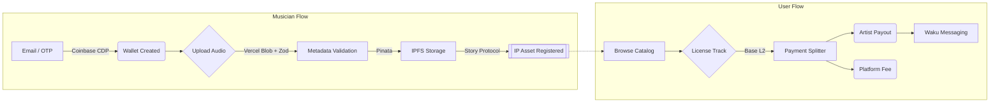

<div align="center">
  
  <h1>Side B Sessions</h1>
  <p><em>Licensing the music that algorithms ignore.</em></p>

  <p>
    
    
    
    
    
    
    
    
  </p>

  <p>🎧 ─── 📀 ─── 🎧</p>
</div>

## Problem & Core Idea

Musicians rarely earn meaningful income from streaming unless they become full-time content creators. Hundreds of hours of practice, voice notes, and jams sit on hard drives, unmonetized and unprotected.  
**Side B Sessions** turns these "Side B" tracks into registered IP assets that filmmakers and game devs can license instantly.

> [!NOTE]
> Honoring practice hours, not follower counts.

## Features

| Feature | Description |
| :--- | :--- |
| 📜 **IP-backed Catalog** | Every upload is registered as a programmable IP Asset on Story Protocol. |
| ⚡ **Invisible Web3** | Email login creates a non-custodial wallet instantly via Coinbase CDP. |
| ☁️ **Secure Storage** | Audio secured via Vercel Blob (hot) + IPFS/Pinata (permanent). |
| � **Licensing on Base** | Transparent USDC/ETH payments on Base L2 using `SideBPaymentSplitter`. |
| � **Messaging** | End-to-end encrypted collaboration requests powered by Waku. |
| ⚖️ **Rights Management** | Automated royalty splits and license verification on-chain. |
| � **Creator Dashboard** | Track plays, licenses, and earnings in a unified musician view. |

## Architecture Overview



## Tech Stack

### Frontend & UX
*   **Next.js 14 (App Router)** — React Server Components for performance and SEO.
*   **TailwindCSS + shadcn/ui** — Rapid, accessible, and premium UI development.
*   **Framer Motion** — Smooth interactions and "surreal" micro-animations.

### Web3 & IP
*   **Story Protocol SDK** — Programmable IP layer for asset registration and licensing rights.
*   **Coinbase CDP** — Embedded wallets for seamless onboarding (no keys required).
*   **Base L2 & viem** — Fast, low-cost execution environment for payments.
*   **SideBPaymentSplitter** — Custom Solidity contract for trustless royalty distribution.

### Data & Storage
*   **Prisma + PostgreSQL** — Relational data for users, catalog state, and indexing.
*   **Vercel Blob** — High-performance audio streaming.
*   **IPFS / Pinata** — Decentralized, immutable persistence for IP media files.

### Messaging & Infra
*   **Waku SDK** — Decentralized, privacy-preserving communication layer.
*   **Halliday** — (Optional) Fiat on-ramp for credit card payments.

<details>
<summary>🛠 <strong>For devs: Story + CDP in one glance</strong></summary>

<br>

> [!IMPORTANT]
> Full IP lifecycle handled: upload → IP registration → licensing → payment verification → messaging.

```typescript
// Example: Registering an IP Asset with Story Protocol SDK
import { StoryClient, StoryConfig } from '@story-protocol/core-sdk';

async function registerSideBTrack(audioHash: string, metadata: TrackMetadata) {
  const client = StoryClient.newClient(config);
  
  const response = await client.ipAsset.register({
    nftContract: SIDE_B_NFT_ADDRESS,
    tokenId: metadata.tokenId,
    ipMetadata: {
      title: metadata.title,
      hash: audioHash, // IPFS CID
      mediaUrl: `ipfs://${audioHash}`,
    },
    txOptions: { waitForTransaction: true }
  });
  
  return response.ipId; // The global Story Protocol IP Identifier
}
```

This project integrates [Story Protocol][1], [Coinbase CDP][2], [Base][3], and [Waku][4].

</details>

<br>

<p align="center">
  <small>Built for the <strong>Surreal World Assets Buildathon 2025</strong> on Story Protocol.</small>
</p>

<div align="center">
  <hr />
  <p>From México with 🧡</p>
</div>

[^1]: https://docs.storyprotocol.xyz
[^2]: https://docs.cloud.coinbase.com/waas
[^3]: https://docs.base.org
[^4]: https://waku.org