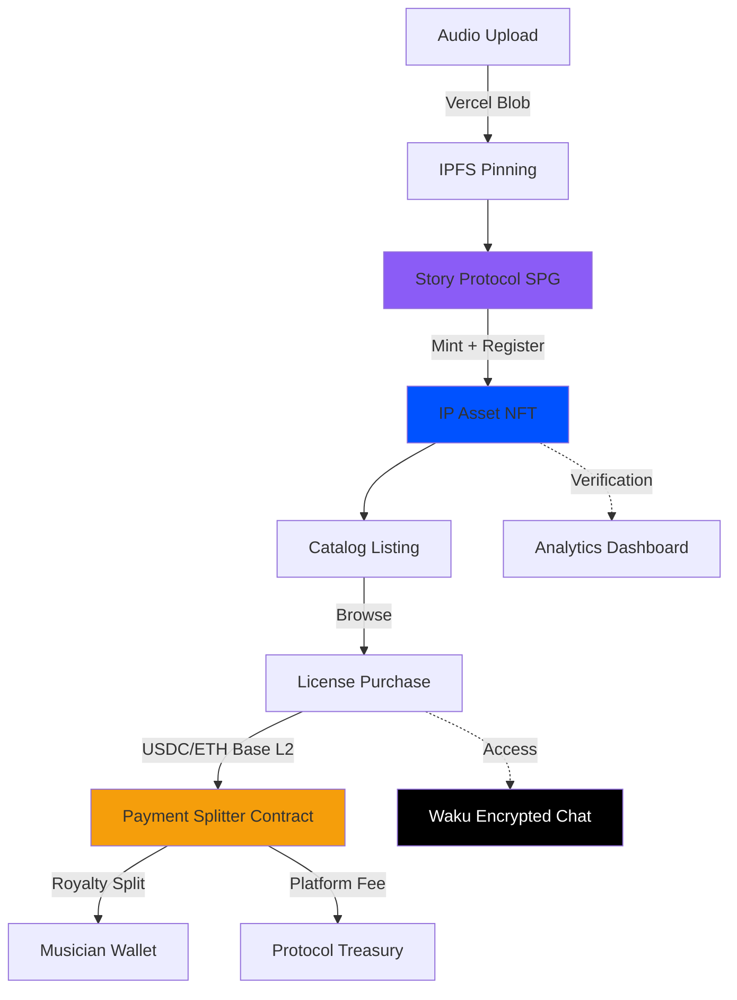

<p align="center">
  
</p>

<h1 align="center">Side B Sessions</h1>
<p align="center"><em>Independent music IP registry and licensing marketplace</em></p>

<p align="center">
  
  
  
  
  
  
  
  
</p>

<p align="center">🎧 ─── 📀 ─── 🎧</p>

---

## What It Does

Musicians upload sessions → automatic IP registration on Story Protocol → listed in catalog → creators license tracks with USDC/ETH on Base → payments split on-chain → both parties receive ownership verification and encrypted messaging access. Zero crypto knowledge required.

---

## Features

<table>
<tr><td>

🛡️ **Verified IP Rights** — Every upload mints an NFT and registers as IP asset via Story Protocol SPG

</td></tr>
<tr><td>

🎵 **Audio Upload Pipeline** — Blob storage + IPFS pinning with format validation and metadata extraction

</td></tr>
<tr><td>

💰 **On-Chain Licensing** — USDC/ETH payments on Base L2 with automated royalty splits via smart contracts

</td></tr>
<tr><td>

🔗 **Blockchain Verification** — Immutable ownership records with Story Protocol + Base transaction proofs

</td></tr>
<tr><td>

🔒 **Encrypted Messaging** — Waku-powered P2P communication between musicians and creators

</td></tr>
<tr><td>

📊 **Analytics Dashboard** — Real-time licensing metrics, revenue tracking, and audience insights

</td></tr>
<tr><td>

🤝 **Two-Sided Marketplace** — Musicians monetize sessions, creators license authentic sound with verified rights

</td></tr>
</table>

---

## Architecture



---

## Tech Stack

**Frontend & UX**
Next.js 14.2 App Router • React 18 Server Components • TypeScript • Tailwind CSS • shadcn/ui • Framer Motion • Refined Brutalism design system

**Web3 & IP Infrastructure**
Story Protocol SDK[^1] • Coinbase CDP[^2] wallet-as-a-service • Base Network[^3] L2 for settlements • Viem 2.21 Ethereum interactions • Foundry smart contract framework

**Data & Storage**
PostgreSQL with Prisma ORM • Vercel Blob for audio files • Pinata IPFS for decentralized permanence • Zod runtime validation

**Messaging & Infrastructure**
Waku Protocol for encrypted P2P messaging • Halliday fiat on-ramp integration • Story Protocol SPG NFT collections

---

<details>
<summary><strong>Advanced Developer Reference</strong></summary>

> [!IMPORTANT]
> Production deployment uses Coinbase CDP for seamless email/OTP authentication, eliminating seed phrase management while maintaining non-custodial wallet control. All IP registrations are verifiable on Story Protocol's Aeneid testnet.

**Story Protocol IP Asset Registration**

```typescript
import { StoryClient } from '@story-protocol/core-sdk'

const registerIPAsset = async (nftContract: string, tokenId: string) => {
  const ipAsset = await client.ipAsset.register({
    nftContract,
    tokenId,
    metadata: {
      name: session.title,
      description: session.description,
      attributes: [{ key: 'contentType', value: session.contentType }]
    }
  })
  return ipAsset.ipId // Returns permanent IP identifier
}
```

**Installation & Setup**
See [docs/INSTALLATION.md](docs/INSTALLATION.md) for complete development environment configuration including `.env.example`, database schema, and local blockchain setup.

**Reference Documentation**
[Story Protocol Docs](https://docs.story.foundation) • [Coinbase CDP Quickstart](https://docs.cdp.coinbase.com) • [Base Network Guide](https://docs.base.org)

</details>

---

<p align="center">
  <strong>Built for <a href="https://dorahacks.io/buidl/19768">Surreal World Assets Buildathon 2025</a></strong>
</p>

<p align="center">
  From México with ❤️‍🔥
</p>

---

[^1]: Story Protocol provides programmable IP infrastructure for registering creative works as on-chain assets with commercial rights management.
[^2]: Coinbase Developer Platform offers embedded wallet solutions with email/social authentication and gasless transactions.
[^3]: Base is Coinbase's Ethereum L2 optimized for low-cost transactions and seamless fiat-to-crypto on-ramps.
